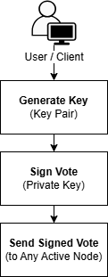
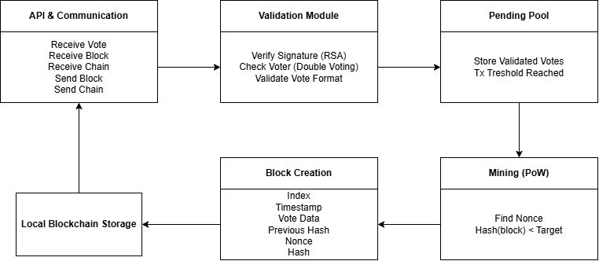
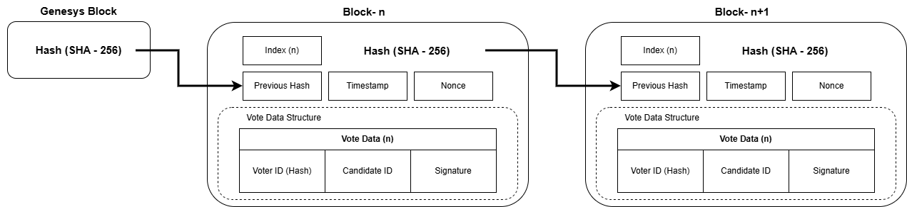
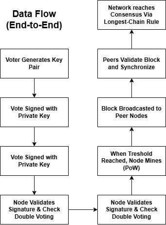
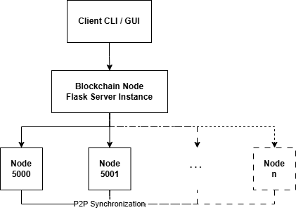

# Architecture of Decentralized Voting Blockchain System
## 1. Overview
The system is a decentralized voting blockchain built on a peer-to-peer (P2P) network architecture. Each node operates independently while maintaining consensus through blockchain synchronization and Proof-of-Work (PoW). The system ensures tamper-resistant voting, distributed trust, and real-time state consistency across all nodes.

## 2. System Architecture
The system is a decentralized voting blockchain built on a peer-to-peer (P2P) network where each node maintains a full copy of the ledger and participates equally in validation and synchronization. Votes are submitted as digitally signed transactions, validated by nodes, then grouped into blocks through Proof-of-Work before being propagated across the network to maintain consensus.

## 3. System Architecture Layers
The system is composed of four main layers:

### 3.1 Client Layer
The client layer is responsible for user interaction and cryptographic vote generation.

**Responsibilities:**
- Generate RSA key pairs (public/private key)
- Sign vote transactions using private key
- Submit votes to active blockchain nodes
- Retrieve blockchain results and status

**Security Role:**
- Ensures vote authenticity via digital signature
- Prevents unauthorized vote manipulation

### 3.2 Blockchain Node Layer
Each node maintains a full copy of the blockchain and processes incoming transactions.

**Core Functions:**
- Validate incoming votes using public key verification
- Store votes in a pending transaction pool
- Create new blocks when threshold is reached
- Execute Proof-of-Work (PoW) mining
- Persist blockchain state to local storage

**Key Components:**
- Transaction pool (pending votes)
- Block creation module
- Signature verification engine
- Mining (PoW difficulty-based hashing)

### 3.3 P2P Network & Synchronization Layer
This layer handles decentralized communication between nodes.

**Mechanisms:**
- Peer discovery via bootstrap nodes
- Peer propagation (gossip-style broadcasting)
- Blockchain synchronization using longest-chain rule
- Block propagation across nodes
- Conflict resolution between competing chains

**Synchronization Flow:**
1. Node joins network via seed/bootstrap node  
2. Peer list is exchanged between nodes  
3. Node synchronizes blockchain state  
4. Conflicts resolved using chain validity + length priority  

### 3.4 Blockchain Structure
Each block in the system contains structured and verifiable data.

**Block Schema:**
- Index  
- Timestamp  
- Vote Data (transactions)  
- Previous Hash  
- Nonce  
- Current Hash  

**Properties:**
- Immutable once mined  
- Cryptographically linked via hash pointers  
- Verified using Proof-of-Work difficulty rule  

## 4. Data Flow (End-to-End)
The voting process follows this sequence:
1. Voter generates RSA key pair  
2. Voter signs vote using private key  
3. Client sends signed vote to active node  
4. Node validates:
   - Signature authenticity  
   - Double voting prevention  
5. Vote enters pending pool  
6. When threshold is reached:
   - Node mines new block (PoW)  
7. Block is broadcast to peers  
8. Other nodes validate and append block  
9. Network reaches consensus (longest valid chain)

## 5. Peer-to-Peer Synchronization Model
The system uses a hybrid P2P model:

**Features:**
- Fully decentralized (no central authority)
- Gossip-based peer propagation
- Eventual consistency model
- Bootstrap-assisted discovery

**Conflict Resolution:**
Nodes resolve inconsistencies using:
- Longest valid chain rule
- Proof-of-Work validation
- Chain integrity verification

## 6. Security Model
The system implements multiple security layers:
- **Digital Signatures (RSA):** Prevent vote forgery  
- **Hash Linking:** Prevent block tampering  
- **Proof-of-Work Mining:** Prevent spam/fake blocks  
- **Double Vote Detection:** Ensures one-voter-one-vote  
- **Chain Validation:** Prevent invalid chain injection  

## 7. Performance & Scalability Notes
- Lightweight Flask-based node implementation  
- Local JSON persistence per node  
- Horizontal scalability via peer addition  
- Suitable for small-to-medium distributed environments  