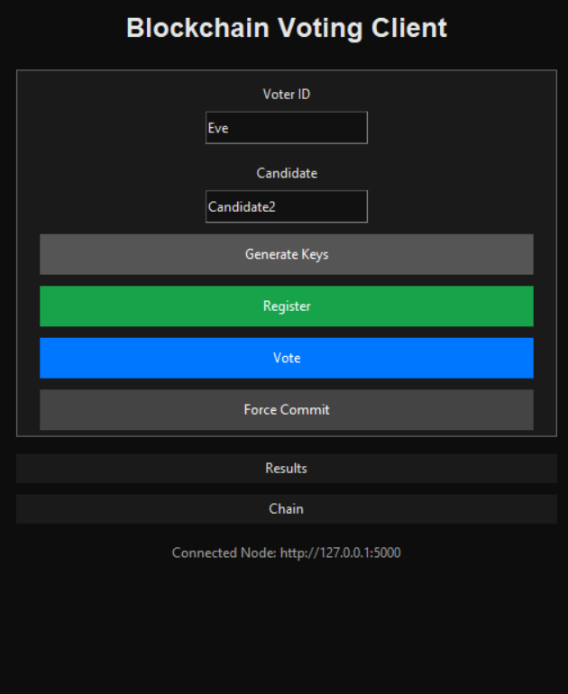
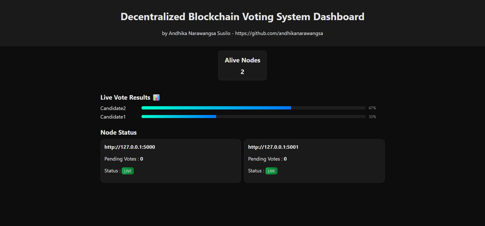

# Setup Guide
## Install Dependencies

```bash
pip install flask flask-cors requests cryptography
```
## Run Nodes
```bash
python server.py 5000
python server.py 5001
python server.py 5002
...
python server.py XXXX
```

## Run Client (CLI)
### Available Commands : 
```bash
python client.py genkeys <voter_id>
python client.py register <voter_id>
python client.py vote <voter_id> <candidate>
python client.py force_commit
python client.py chain
python client.py resuls
python client.py reset
python client.py validate
python client.py export
python client.py import <filename>
```
## Run Client (GUI)
```bash
python clientGUI.py
```


## Dashboard Monitoring
```bash
run dashboard/index.html
```


